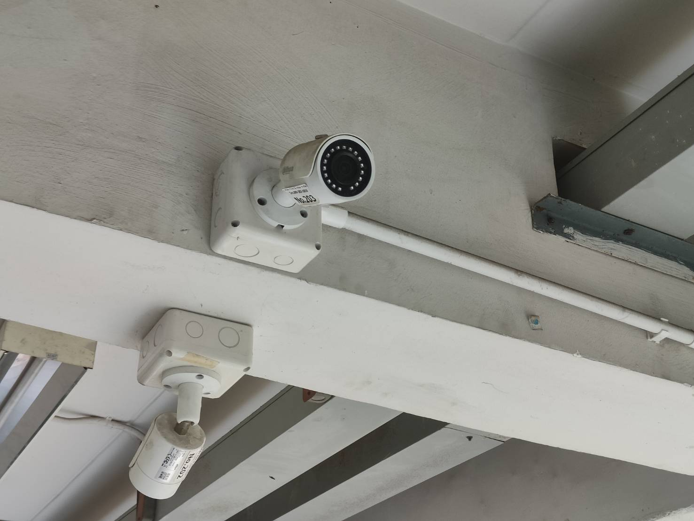
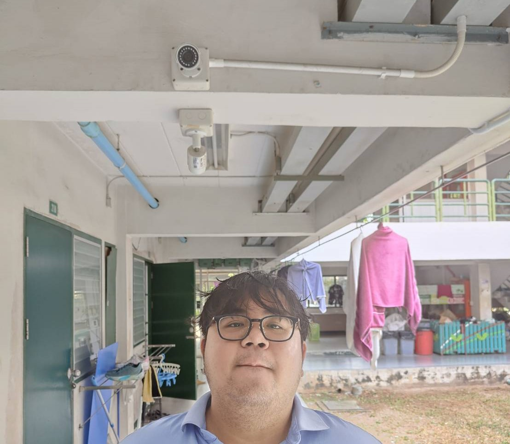

# Security Control

## 📷 กล้องวงจรปิด CCTV 📷

* ### locattion : หอในแอ๊กกี้ ตึก 2
* ### Type of SecurityControl : Physical Control
* ### Control Function : Detective

  

กล้องวงจรปิด (CCTV - Closed-Circuit Television) คือ อุปกรณ์บันทึกภาพและวิดีโอที่ใช้สำหรับเฝ้าระวังและรักษาความปลอดภัย โดยระบบจะส่งภาพไปยังจอแสดงผลของผู้ที่ดูอยู่ โดยจะไม่เผยแพร่ภาพสู่สาธารณะ

## 📖 สรุป 📖
กล้องวงจรปิดเป็นทั้ง Physical Control และ Detective เพราะ
* ในด้านของ Physical Control ใช้ตรวจสอบและควบคุมความปลอดภัย โดยช่วยป้องกันการบุกรุก เฝ้าระวังเหตุการณ์ที่ผิดปกติ และบันทึกหลักฐานทั้งหมดในพื้นที่ที่ติดตั้ง
* ในด้านของ Detective Control ใช้ตรวจจับและบันทึกเหตุการณ์ที่เกิดขึ้น ช่วยให้ตรวจจับพฤติกรรมที่ดูผิดปกติ โดยไม่จำเป็นต้องมีการตอบสนองในทันที หรือใช้เป็นหลักฐานเมื่อเกิดเหตุการณ์ที่ไม่พึงประสงค์ได้

## [🏠 Home](README.md)
